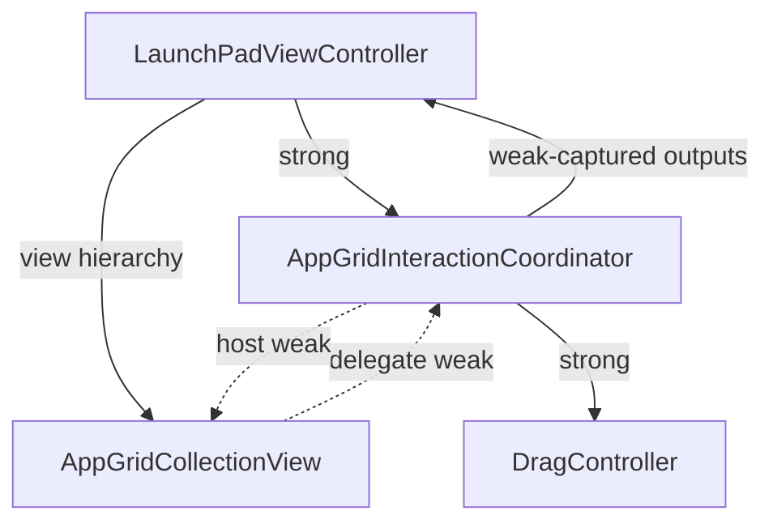

# App Grid 外部交互协调器设计

> 日期：2026-07-22
>
> 状态：架构方向与不保留兼容门面已确认，文档自审完成，等待用户书面复核
>
> 分支：`release-readiness`

## 1. 决策

主网格不再使用 `NSCollectionView.delegate === collectionView` 的 self-delegate
拓扑，也不在 `AppGridCollectionView` 内部持有纯转发 proxy。

采用一个真正拥有主网格选择、拖拽与放置交互的
`AppGridInteractionCoordinator`：

- `LaunchPadViewController` 强持有 coordinator；
- 视图树强持有 `AppGridCollectionView`；
- AppKit 的 `collectionView.delegate` 弱引用 coordinator；
- coordinator 弱引用网格 host，强持有 `DragController` 和自身需要的窄依赖；
- coordinator 到 ViewController 的输出闭包使用弱捕获；
- 删除主网格旧交互门面并同步修改当前测试和后续 Task 5、16、19，不保留
  deprecated bridge。

本次迁移改变对象所有权和源码接口，但不改变已存在的产品交互语义。拖放领域模型、
左右边缘方向、坐标转换、乐观 snapshot 和持久化契约仍由既有 Task 15、16、18、19
负责。

## 2. 问题证据

当前 `AppGridCollectionView.setup()` 把 `delegate` 设置为 `self`，同一类型还实现了
选择、pasteboard writer、drop validation、drop acceptance 和 drag image 五个 delegate
入口。这个拓扑在当前 macOS 26 AppKit 中已沿三条独立路径稳定不收敛：

1. 首次 diffable reload 在 `willDisplayItem` 的弱 delegate 查询中热循环；
2. metrics 更新触发 `reloadItems` 后在 `didEndDisplayingItem` 的弱 delegate 查询中
   热循环；
3. `deselectAll` 在 `shouldDeselectItemsAtIndexPaths` 的弱 delegate 查询中热循环。

单变量证据：

- 对齐 host、collection frame 和 metrics 后仍挂起；
- 禁用动画、移除真实 window、显式设置 frame 均不改变结果；
- `delegate = nil` 时精确测试 0.132 秒通过；
- 外部非空 no-op delegate 时 0.134 秒通过；
- 外部 delegate 完整转发现有五个业务方法时 0.156 秒通过；
- 恢复 self-delegate 后相同 metrics 更新再次挂起；
- AppKit 的 `NSDiffableDataSourceSnapshot` 没有 UIKit 的
  `reconfigureItems(_:)`，编译器已拒绝该替代方案。

原始采样证据：

- `/tmp/swiftpm-testing-helper_2026-07-22_173759_lAX6.sample.txt`；
- `/tmp/swiftpm-testing-helper_2026-07-22_175535_3tUD.sample.txt`；
- `/tmp/swiftpm-testing-helper_2026-07-22_175812_1jRL.sample.txt`。

SDK 头文件还证明：

- `NSCollectionView.delegate` 是弱引用；
- selection、pasteboard writer、validate/accept drop 都属于
  `NSCollectionViewDelegate`；
- `selectItems(at:scrollPosition:)` 和 `deselectItems(at:)` 不通知 selection
  delegate；
- `selectAll` 和 `deselectAll` 会通知 delegate。

因此不能通过重写少量 `NSCollectionView` 子类方法完整替代 delegate，也不能在测试中
长期使用 nil/no-op delegate 掩盖生产路径。

## 3. 目标与非目标

### 3.1 目标

1. 消除 self-delegate 导致的 reload、display 和 selection 热循环。
2. 让 `AppGridCollectionView` 回归网格渲染、布局、cell 配置和 diffable snapshot
   管理职责。
3. 让 coordinator 独占 AppKit selection 与 drag/drop delegate 规则。
4. 保持选择回调的 `changed` 后 `activated` 顺序和现有五个 delegate 方法的全部
   分支语义。
5. 让生命周期所有权显式、无循环引用、可重复装配和释放。
6. 为 Task 5 的稳定选择以及 Task 16/19 的完整拖放提供清晰扩展点。
7. 用真实 AppKit 集成测试和始终启用的墙钟断言防止热循环回归。

### 3.2 非目标

本次不得顺手修复或改变以下现有行为：

- 左右边缘当前都降级为同一个 `.screenEdge` 状态；
- `draggingLocation` 尚未完成窗口坐标到网格局部坐标的单次转换；
- 普通 drop 当前会乐观修改 diffable snapshot；
- `DragController.currentOrder` 与视觉 snapshot 的持久化模型尚未统一；
- `acceptDrop` 与长按手势结束存在两个 terminal drop 入口；
- app-on-app、app-on-group、跨页、空白追加、folder child drag-out 的最终领域
  mutation 规则。

这些问题已经有独立的 Task 15、16、18、19 归属。coordinator 抽取必须用 parity
测试锁定当前行为；后续任务再通过独立 RED-GREEN 修改行为。

## 4. 所有权与生命周期



`LaunchPadViewController.loadView()` 每次创建新网格时，同时创建新 coordinator 并完成
装配。重建视图或显式 teardown 时执行：

1. coordinator 的 `detach()` 仅在当前 delegate 身份仍是自身时清空 delegate；
2. 清空 coordinator 对 host 的弱引用，但保留已经装配的输出闭包；
3. 释放 ViewController 对 coordinator 的强引用；
4. 不让 coordinator 延长旧网格或旧 ViewController 生命周期。

`attach()` 和 `detach()` 必须幂等。换绑 host 时先 `detach()`，输出闭包继续有效，避免
coordinator 已成为新 delegate 但事件无法回到 ViewController。coordinator 不在
`deinit` 中修改 delegate 或执行业务操作；AppKit 的弱 delegate 在 coordinator 释放后
自动清空。

所有 AppKit 类型和入口保持 `@MainActor` 隔离。

## 5. 组件职责

### 5.1 `AppGridCollectionView`

保留：

- diffable data source 和 snapshot apply；
- `GridMetrics`、layout 与 cell reconfiguration；
- AppIcon/Folder cell 配置；
- accessibility rows；
- entrance animation；
- 稳定 ID 到 indexPath 的程序化选择；
- drag image 的实际视图绘制；
- coordinator 所需的窄 host 查询和视觉更新能力。

删除或迁出：

- `NSCollectionViewDelegate` conformance；
- `delegate = self`；
- `onItemSelected`；
- `onSelectionChanged`；
- `dragController`；
- `pasteboardUUIDReader`；
- `resolveHoverLocation`、`extractDraggedItem`、`performDrop`、`findItem`；
- 五个 `NSCollectionViewDelegate` 方法。

`onItemDelete` 和 `onFolderRenamed` 仍由网格持有，因为它们来自 cell 内部控件，不是
collection delegate 交互。

程序化 `selectItem(id:)` 只负责 AppKit selection 状态并返回 indexPath，不再发送业务
回调。nil 或未知 ID 使用
`deselectItems(at: selectionIndexPaths)` 清空状态，不调用会通知 delegate 的
`deselectAll`。ViewController 的稳定选择入口负责同步 `selectedItemID`。

### 5.2 `AppGridInteractionHosting`

新增 package-internal、`@MainActor`、class-bound 的窄 host 协议：

```swift
@MainActor
protocol AppGridInteractionHosting: AnyObject {
    var collectionViewForDelegateInstallation: NSCollectionView { get }
    // 其余成员仅声明下列 delegate 入口所需的窄能力。
}
```

`AnyObject` 是 coordinator 以 `weak` 持有 protocol existential 的编译期前提。协议避免
coordinator 直接依赖整个 `AppGridCollectionView` 实现或任意访问 diffable internals，
只表达 delegate 安装目标和当前五个入口需要的能力：

- 提供自身对应的 `NSCollectionView` delegate 安装目标；
- 按 indexPath 或 UUID 解析 `PageItem`；
- 按现有 Task 4 语义直接用原始 `draggingLocation` 解析 indexPath，不做坐标转换；
- 读取当前 collection bounds 宽度供既有边缘判断使用，不改用 visible rect；
- 获取指定 indexPath 的可见 cell；
- 生成 drag image；
- 执行当前 Task 4 仍保留的视觉 snapshot move。

协议不暴露 storage、数据库、通用 snapshot setter 或任意闭包事务。Task 16 删除乐观
snapshot 后，最后一项由稳定 `onDropRequested` 输出替代。

### 5.3 `AppGridInteractionCoordinator`

新增：

```swift
@MainActor
final class AppGridInteractionCoordinator: NSObject,
    NSCollectionViewDelegate {
    private(set) weak var host: (any AppGridInteractionHosting)?
    private weak var collectionView: NSCollectionView?
    let dragController: DragController

    var onSelectionChanged: ((PageItem) -> Void)?
    var onItemActivated: ((PageItem) -> Void)?
    var pasteboardUUIDReader: (NSPasteboard) -> String?

    init(
        dragController: DragController,
        pasteboardUUIDReader: @escaping (NSPasteboard) -> String?
    )

    func attach(to host: any AppGridInteractionHosting)
    func detach()
}
```

`AppGridCollectionView` 的安装目标返回 `self`，从类型边界消除 host 与 collection view
错配的可能。`attach()` 负责先安全解绑旧 collection view，再保存弱 host 和其安装目标并
安装自身；`detach()` 只解除 delegate/host，不清空输出闭包。

`onSelectionChanged` 属性可为 nil，表示尚未装配输出；一旦调用，payload 必须是非可选
`PageItem`。程序化清空选择由 ViewController 直接同步 `selectedItemID = nil`，不通过
coordinator 伪造 nil selection 事件。

这是单一 coordinator，不再拆一层 thin adapter 和一层 pure coordinator。当前只有五个
delegate 入口，继续拆分会增加协议、DTO 和转发链而没有对应复用收益。

coordinator 真正拥有以下行为，而不是把五个入口原样转发回网格：

1. selection changed/activated 顺序；
2. pasteboard UUID writer 与 reader；
3. edge、group、app、empty hover 解析；
4. drop validation 与当前阶段的 drop acceptance；
5. drag image delegate 入口；
6. 与 `DragController` 的状态机调用。

视觉绘制仍委托 host；coordinator 不创建 cell、不应用 layout、不访问 storage。

### 5.4 `LaunchPadViewController`

新增强引用 `gridInteractionCoordinator`，并成为唯一生产装配点：

- 创建 coordinator 并注入现有 `DragController`；
- 把 coordinator 安装为网格 delegate；
- `onSelectionChanged` 更新 `selectedItemID`；
- `onItemActivated` 调用现有 `handleItemSelection`；
- 删除给网格设置 `dragController`、`onItemSelected` 和 `onSelectionChanged` 的旧装配。

ViewController 不实现 `NSCollectionViewDelegate`，也不接触 pasteboard、命中测试、
drag image 或 diffable move 细节。

## 6. 五个 delegate 分支合同

### 6.1 Selection

- 空 indexPath 集合：不发送事件；
- indexPath 无对应 item：不发送事件；
- 有效 item：先 `onSelectionChanged(item)`，再 `onItemActivated(item)`；
- 本次不实现 `didDeselectItemsAt`，非可选 payload 从类型层禁止新增 nil 回调；
- 程序化选择由 ViewController 的稳定 ID 入口同步状态，不依赖 delegate 回调。

### 6.2 Pasteboard writer

- 无 item：返回 nil；
- page item：返回 nil；
- app/group：写入 item UUID 的 `.string` pasteboard item；
- production 默认 reader 仍是 `string(forType: .string)`；测试注入 UUID、nil 或 malformed
  value，不依赖真实 named pasteboard 写入成功。

### 6.3 Validate drop

- 左、右边缘继续保持当前 `.screenEdge + .generic` 行为，且早返时不修改传入的
  `dropOperation`；
- 中间区域命中 group：`.overIcon(targetID)`；
- 中间区域无 indexPath、stale indexPath 无 item、app 或 page：分别解析为 `.empty`；
- 中间区域继续设置 drop operation 为 `.on` 并返回 `.move`；
- `dragController` 不在 dragging 状态时保持现有 no-op 语义。

方向、visible rect 和坐标转换在 Task 16 修改，不能在本次抽取中提前改变。

### 6.4 Accept drop

- pasteboard 缺失或 UUID 无法解析：false；
- target indexPath 无 item：false；
- group target：保持当前完成 drag 并返回 true；
- 普通 target：保持当前视觉 snapshot move 后完成 drag；
- 当前阶段不新增 storage 写入，也不修复 optimistic snapshot。

Task 16 将 acceptance 改为稳定 `GridDropDestination` 和 `onDropRequested`，并删除视觉
snapshot 的乐观修改；修改位置从 AppGrid delegate extension 转移到 coordinator。

### 6.5 Drag image

- indexPaths 为空或无可见 cell：返回空 `NSImage`；
- 有 cell：复用 host 的绘制函数，输出 64x64、alpha 0.7 的图像；
- coordinator 不复制视图渲染算法。

## 7. 数据流

### 7.1 鼠标选择

```text
AppKit delegate callback
  -> AppGridInteractionCoordinator
  -> host.item(at:)
  -> onSelectionChanged
  -> LaunchPadViewController.selectedItemID
  -> onItemActivated
  -> LaunchPadViewController.handleItemSelection
```

### 7.2 键盘或 resize 后恢复选择

```text
LaunchPadViewController.selectItem(id:)
  -> AppGridCollectionView.selectItem(id:)
  -> AppKit selectItems/deselectItems (no delegate notification)
  -> ViewController updates selectedItemID and visible page
```

这避免程序化选择同时经过显式状态更新和 delegate 回调而产生重复事件。

### 7.3 拖放

```text
AppKit drag delegate callback
  -> AppGridInteractionCoordinator
  -> host lookup / hit-test / render
  -> DragController state transition
  -> current Task 4 visual result
```

Task 16 后最后一步改为稳定领域请求，只有 COMMIT 成功后的 ViewController reload 才改变
snapshot。

## 8. 错误与释放策略

- host 已释放：所有 delegate 入口安全返回 nil、false、`.none` 或空图，不触发业务事件；
- stale indexPath/UUID/target：按现有分支拒绝，不强制解包；
- coordinator 不捕获 ViewController 强引用；
- coordinator 不持有 storage，不吞掉领域错误，也不记录底层数据库细节；
- 重复 attach 或换绑 host 时先安全 detach 旧对象，再安装新对象；
- 外部代码替换了 delegate 后，旧 coordinator 的 detach 不得清除新 delegate；
- detach 不清空输出闭包，所有 delegate/host 清理都可重复执行。

## 9. 测试设计

新增 `Tests/LaunchPadTests/Views/AppGridInteractionCoordinatorTests.swift`，使用 Swift
Testing 和 suite-level `@MainActor`。测试分三层。

### 9.1 Coordinator 单元测试

使用 fake host 覆盖全部分支：

- selection：空、未知、有效；
- callback 精确顺序：changed 后 activated；
- writer：app、group、page、missing；
- validation：左边缘、右边缘、group、app、page、无 indexPath、stale indexPath 无 item、
  非 dragging；边缘分支用 sentinel 断言 `dropOperation` 未改变；
- acceptance：nil/malformed/unknown source、missing target、group、普通 move、两者不存在；
- drag image：empty indexPaths、missing cell、valid cell；
- 每个分支断言 host 查询、视觉 move 和 DragController 调用次数及参数。

### 9.2 AppKit wiring 与生命周期测试

- `collectionView.delegate === coordinator` 且 `delegate !== collectionView`；
- coordinator 局部变量退出后仍由 ViewController 强持有；
- coordinator 弱 host 不延长 grid 生命周期；
- ViewController/grid/coordinator 可释放，无循环引用；
- 重建 view 后旧 grid delegate 被清理，新 grid 只绑定新 coordinator；
- 同一 grid 重复 attach 不改变 wiring；从 grid A 换绑到 grid B 后 A 的 delegate 为 nil、
  B 的 delegate 为 coordinator，且既有输出闭包仍有效；
- 外部 delegate 覆盖后调用 detach 不清除外部 delegate；连续 detach 两次保持 no-op；
- host 释放后五个 delegate 入口分别返回各自安全默认值且不发送输出；
- `selectItem(id:)` 对有效、nil、未知 ID 都不触发 coordinator 输出；
- 至少一个 selection 和一个 drag 测试通过真实 `collectionView.delegate` 调用，禁止只
  直接调用 coordinator 方法证明 wiring。

### 9.3 macOS 26 热循环回归

使用真实 `NSWindow + NSScrollView + AppGridCollectionView`，加载一个 app 和一个 folder，
连续执行：

1. apply initial metrics；
2. diffable reload 并创建真实可见 cells；
3. apply updated metrics 并断言两个 cell 使用同一新 icon size；
4. 真实 selection；
5. 程序化 clear selection；
6. 再执行一次 reload/selection 周期。

测试使用 `ContinuousClock`，始终断言能够返回的测试体耗时小于 1 秒；不得通过环境
变量、trait、重试、阈值倍增或 skip 关闭。同步热循环无法到达测试体末尾，因此 Task 4
必须新增可执行的 `scripts/run-with-timeout.sh`，以独立进程组运行任意命令：超时先向
整个进程组发送 TERM，限时回收后发送 KILL，reap 子进程并返回 124；普通非零退出和
signal 必须原样传播，且不得残留 `swift-test` 或测试 bundle 进程。

watchdog 必须自测 timeout、signal 转发和非零退出三条分支，并逐条证明子孙进程组已经
清理。Task 4 focused suite 使用 30 秒上限；完整串行 suite 和 Task 22 最终 release gate
使用各自明确的上限，但必须调用同一脚本，不允许复制另一份 timeout 实现或直接运行
权威门禁命令。`ContinuousClock < 1s` 是返回路径性能门禁，进程 watchdog 是不收敛路径
门禁，两者缺一不可。

`AppGridCollectionViewTests` 继续验证 layout、snapshot、cell、accessibility 和程序化稳定
选择；原先直接调用五个 delegate 方法及交互 helper 的测试迁移到 coordinator suite。
`LaunchPadViewControllerTests` 验证装配、选择输出和 app/group/page activation。

## 10. 下游计划调整

批准本设计后，实施计划必须同步更新以下合同：

- Task 4：增加 coordinator 生产/测试文件、RED-GREEN、真实 wiring、生命周期、
  `scripts/run-with-timeout.sh` 及其进程组清理自测；
- Task 5：把 `collectionView.onSelectionChanged` 绑定改为
  `gridInteractionCoordinator.onSelectionChanged`，稳定 ID 程序化选择仍通过 grid；
- Task 16：`pasteboardUUIDReader`、source/validation/acceptance、stable destination 和
  `onDropRequested` 的归属改为 coordinator；host 只提供视觉与 snapshot 查询；
- Task 19：主网格 drop 继续经 coordinator；folder overlay 的独立 delegate 重构需要在
  Task 19 自己的设计/RED 中决定，不在本次提前统一；
- Task 22：`scripts/test-release.sh` 必须消费 Task 4 的共享 watchdog，不再内联第二份
  `run_with_timeout`；完整串行 suite 的每次运行都经共享 watchdog；
- 所有测试示例禁止再直接调用
  `collectionView.collectionView(collectionView, ...)` 来绕过实际 delegate wiring。

后续文档不得继续要求 `AppGridCollectionView` 公开 `dragController`、
`onItemSelected`、`onSelectionChanged` 或 `pasteboardUUIDReader`。

## 11. 被拒绝方案

### 11.1 内部强持纯转发 proxy

能以最小改动修复热循环，但所有交互行为仍留在 500 行以上的网格类型中；未来每增加
delegate 方法都需要同步转发，SRP、测试隔离和扩展性没有实质改善。用户已明确选择不
保留该过渡架构。

### 11.2 `LaunchPadViewController` 直接成为 delegate

ViewController 已负责存储、搜索、键盘、动画、分页、文件夹和拖拽协调。再加入 pasteboard、
hit testing、drag image 和 diffable move 会继续放大 675 行控制器，并把 AppKit 适配细节
混入业务协调层。

### 11.3 Thin adapter + pure coordinator 两层

理论隔离更强，但当前只有五个 delegate 入口，会增加第二个对象、额外协议/DTO 和转发链。
等相同 drop policy 被主网格与 folder grid 实际复用时再评估拆分；当前属于过度设计。

### 11.4 重写鼠标和 dragging destination 事件

AppKit 没有覆盖全部 selection/drag delegate 语义的等价 override 集合。自行重造会破坏
键盘选择、拖拽 formation、pasteboard writer、highlight 和 accessibility 行为，风险最高。

### 11.5 nil/no-op delegate 测试夹具

这只会绕过 production topology。恢复 self-delegate 后 updated metrics 已再次挂起，因此
该方案会制造假 GREEN。

## 12. 完成标准

设计只有在以下条件全部满足时才算实现完成：

1. production 没有 `delegate = self`，`AppGridCollectionView` 不再 conform
   `NSCollectionViewDelegate`；
2. production 和测试均不存在旧交互门面及绕过实际 delegate 的调用；
3. coordinator 五个入口和全部现有分支有一对一测试；
4. reload/display/metrics/selection 集成测试在真实 host 下通过且墙钟断言始终执行；
5. coordinator/grid/ViewController 生命周期测试证明无提前释放和引用环；
6. 共享 watchdog 的 timeout/signal/nonzero 自测通过，focused 与完整串行 suite 均通过
   它运行且无残留进程；
7. Task 4 focused suite、相邻 layout/VC/DragController suites、build 和完整串行 suite
   通过；
8. 无 signal、timeout、残留测试进程、真实系统 pasteboard/Dock/Workspace 副作用；
9. Task 4、5、16、19、22 的实施文档接口与本设计一致；
10. 独立审查确认 Critical/Important 为零后才能继续下一任务。
